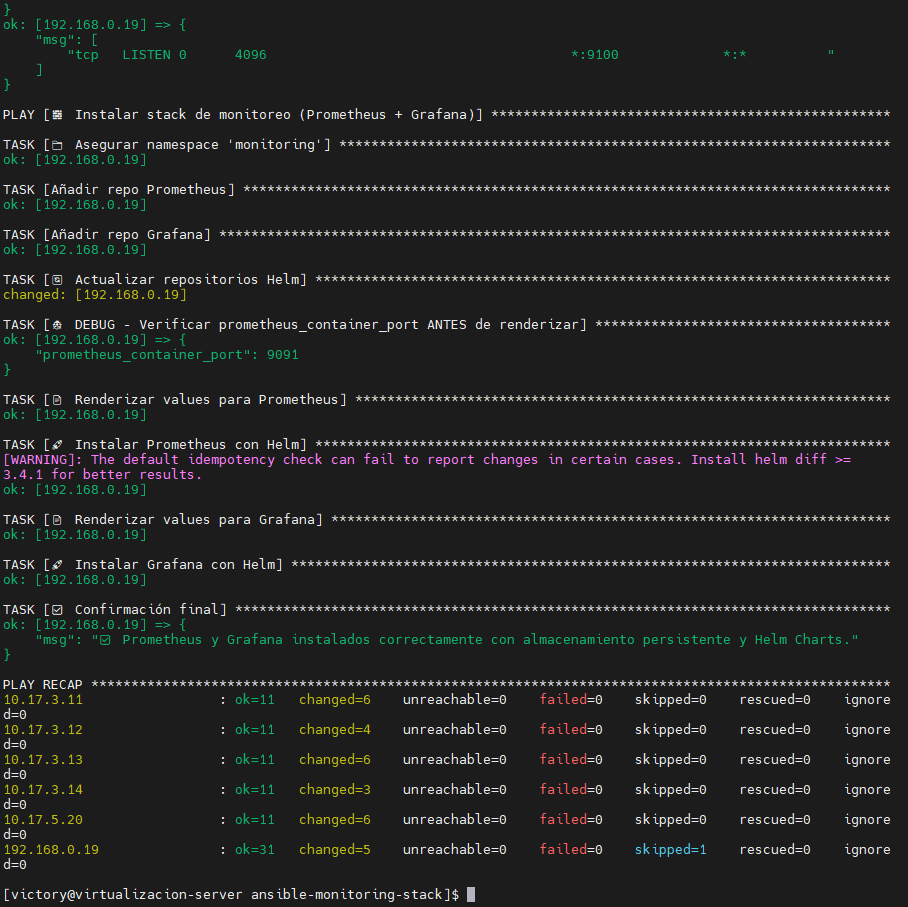
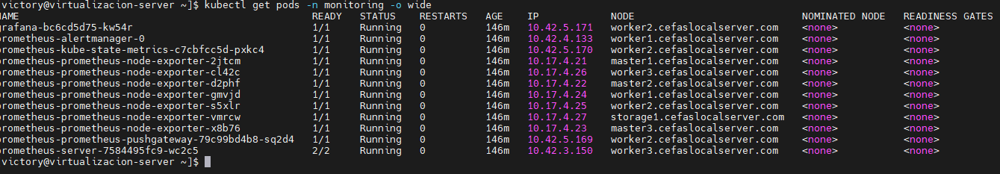
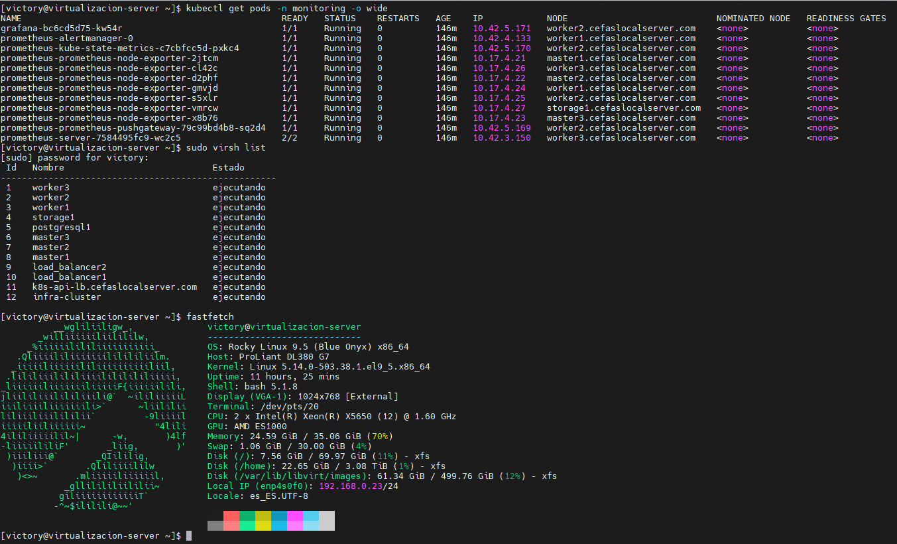
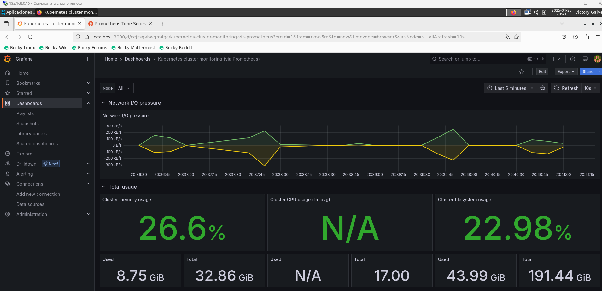
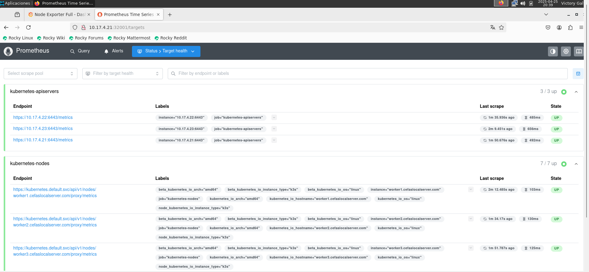

# ansible-monitoring-stack

**Automatización del despliegue de Prometheus y Grafana en un clúster Kubernetes (K3s) utilizando Ansible, Helm y almacenamiento persistente con Longhorn.**

Este proyecto forma parte del stack [FlatcarMicroCloud](https://github.com/vhgalvez/FlatcarMicroCloud), ofreciendo una solución automatizada para monitorear nodos y servicios con Prometheus y Grafana. Además, permite la instalación de **Node Exporter** para la recolección de métricas de los nodos, todo gestionado con **Ansible**.

## ⚙️ Requisitos

Antes de comenzar, asegúrate de tener lo siguiente instalado y configurado:

- Acceso por SSH a nodos masters.
- Acceso a `kubectl` y `helm` en el nodo desde el que ejecutarás los playbooks.
- Kubernetes en funcionamiento (K3s o estándar).
- PVCs con `storageClassName: longhorn` para persistencia de datos.
- Colecciones necesarias de Ansible:

```bash
ansible-galaxy collection install community.kubernetes kubernetes.core
```

---

## 🎯 Ejecución

### 1. Instalar el stack completo

Este playbook instalará Prometheus y Grafana en Kubernetes, configurará PVCs para persistencia de datos y utilizará Helm para gestionar los charts de ambas herramientas:

```bash
source .env
sudo -E ansible-playbook -i inventory/hosts.ini playbook/deploy_monitoring_stack.yml
```

### 2. Actualizar los targets de scrape de Prometheus

Si necesitas añadir o actualizar los nodos a los que Prometheus realizará scrape de métricas, ejecuta:

```bash
sudo ansible-playbook -i inventory/hosts.ini playbook/03_update_scrape_targets.yml
```

### 3. Eliminar el stack de monitoreo

Para eliminar todo el stack, incluyendo Prometheus y Grafana:

```bash
sudo ansible-playbook -i inventory/hosts.ini uninstall_stack.yml
```


---

## 🔧 Playbooks incluidos

### Playbook principal


Para desplegar el stack de monitoreo, utiliza el siguiente comando:

```bash
source .env
sudo -E ansible-playbook -i inventory/hosts.ini playbook/deploy_monitoring_stack.yml
```

Este playbook realiza las siguientes tareas:

- Crea el namespace `monitoring` (si no existe).
- Despliega PVCs para Prometheus y Grafana.
- Instala los charts de Helm para `grafana/grafana` y `prometheus-community/prometheus`.
- Configura almacenamiento persistente con Longhorn.

### Otros Playbooks útiles

- **Actualizar los targets de scrape de Prometheus:**

```bash
ansible-playbook -i inventory/hosts.ini playbook/03_update_scrape_targets.yml
```

- **Eliminar todo el stack:**

```bash
sudo -E ansible-playbook -i inventory/hosts.ini uninstall_stack.yml```

---

## ✨ Configuración de Grafana y Prometheus

1. **Configurar Prometheus como fuente de datos en Grafana:**

   - Ingresa a Grafana en [http://localhost:3000](http://localhost:3000).
   - Usa las credenciales por defecto (`admin/admin`).
   - Añade Prometheus como fuente de datos en Grafana:
     - URL de Prometheus: `http://localhost:9090`.

2. **Cargar un Dashboard popular:**

   Grafana tiene varios dashboards preconfigurados para monitorear Node Exporter, Kubernetes y más. Puedes importarlos usando los IDs de dashboard:

   - Node Exporter Full: `1860`
   - K8s Cluster Monitoring: `315`
   - Prometheus Stats: `2`

---

## 🖼 Imágenes de referencia








---

## 📦 Notas adicionales

- Grafana quedará accesible internamente en el namespace `monitoring` con el password definido en `group_vars/all.yml`.
- Los PVCs se almacenan usando Longhorn en modo `ReadWriteOnce`.
- Para exponer Grafana o Prometheus mediante Traefik o NodePort, revisa los servicios correspondientes en Kubernetes.

---


```bash
sudo ansible-playbook -i inventory/hosts.ini playbook/deploy_monitoring_stack.yml
```

## ✨ Créditos

Este proyecto fue creado como parte del stack FlatcarMicroCloud y tiene como objetivo simplificar la gestión de monitoreo en Kubernetes usando herramientas de código abierto y automatización con Ansible.

**Autor:** [@vhgalvez](https://github.com/vhgalvez)

source .env

sudo nano .env

# 🌍 Variables de entorno para Prometheus y Grafana

PROMETHEUS_AUTH_USER="prometheus_admin"
PROMETHEUS_AUTH_PASS="S3cr3tP@ssw0rd!123"

GRAFANA_AUTH_USER="grafana_admin"
GRAFANA_AUTH_PASS="GrafanaS3cr3t!456"

sudo chmod 600 .env

# 🛠️ Variables de entorno para la interfaz de usuario de Prometheus y Grafana

PROMETHEUS_AUTH_USER_UI="prometheus_ui_user"
PROMETHEUS_AUTH_PASS_UI="UI@Prometheus!789"

GRAFANA_AUTH_USER_UI="grafana_ui_user"
GRAFANA_AUTH_PASS_UI="UI@Grafana!789"

```bash
source .env
sudo -E ansible-playbook -i inventory/hosts.ini playbook/deploy_monitoring_stack.yml
```

export PROMETHEUS_AUTH_USER="prometheus_admin"
export PROMETHEUS_AUTH_PASS="S3cr3tP@ssw0rd!123"
export GRAFANA_AUTH_USER="grafana_admin"
export GRAFANA_AUTH_PASS="GrafanaS3cr3t!456"
export PROMETHEUS_AUTH_USER_UI="prometheus_ui_user"
export PROMETHEUS_AUTH_PASS_UI="UI@Prometheus!789"
export GRAFANA_AUTH_USER_UI="grafana_ui_user"
export GRAFANA_AUTH_PASS_UI="UI@Grafana!789"

echo $PROMETHEUS_AUTH_USER_UI
echo $PROMETHEUS_AUTH_PASS_UI
echo $GRAFANA_AUTH_USER_UI
echo $GRAFANA_AUTH_PASS_UI

export PROMETHEUS_AUTH_USER_UI="tu_usuario"
export PROMETHEUS_AUTH_PASS_UI="tu_contraseña"
export GRAFANA_AUTH_USER_UI="tu_usuario"
export GRAFANA_AUTH_PASS_UI="tu_contraseña"
